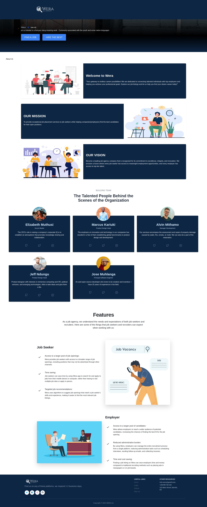
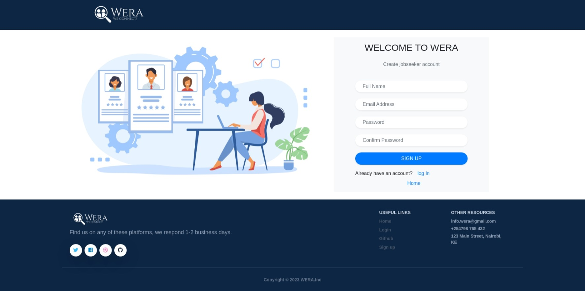
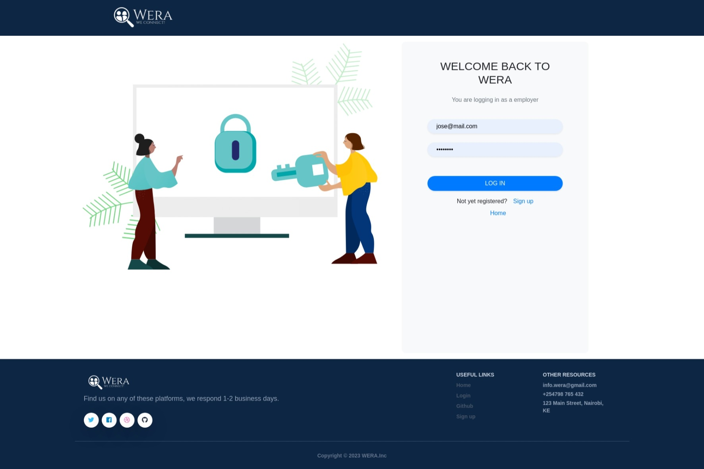
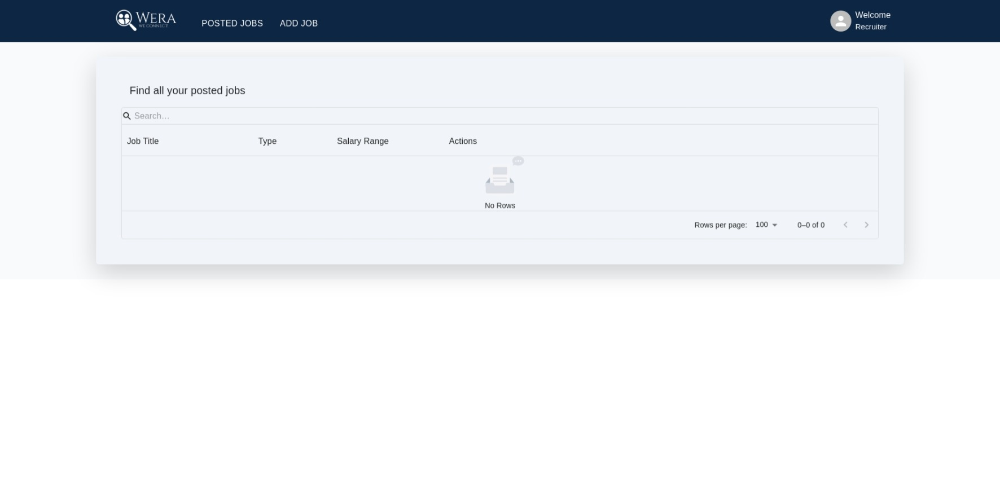
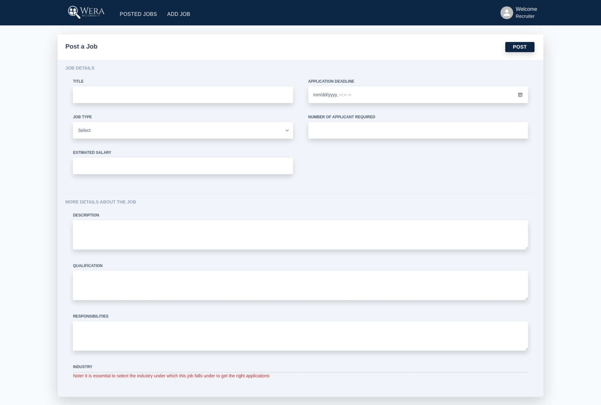
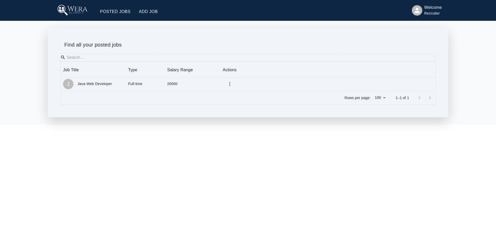
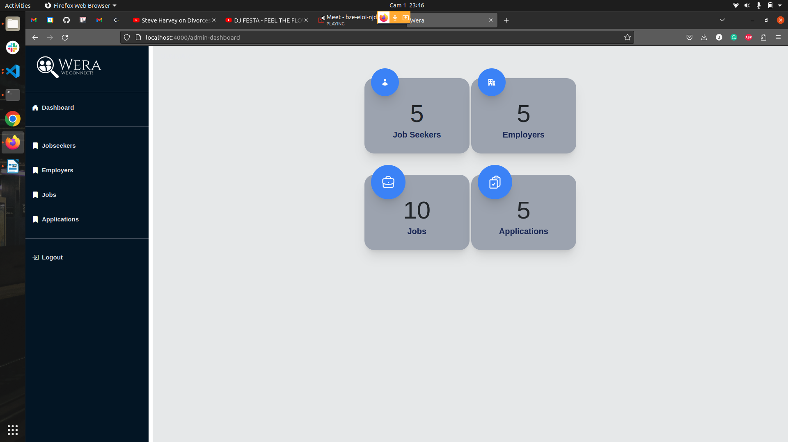
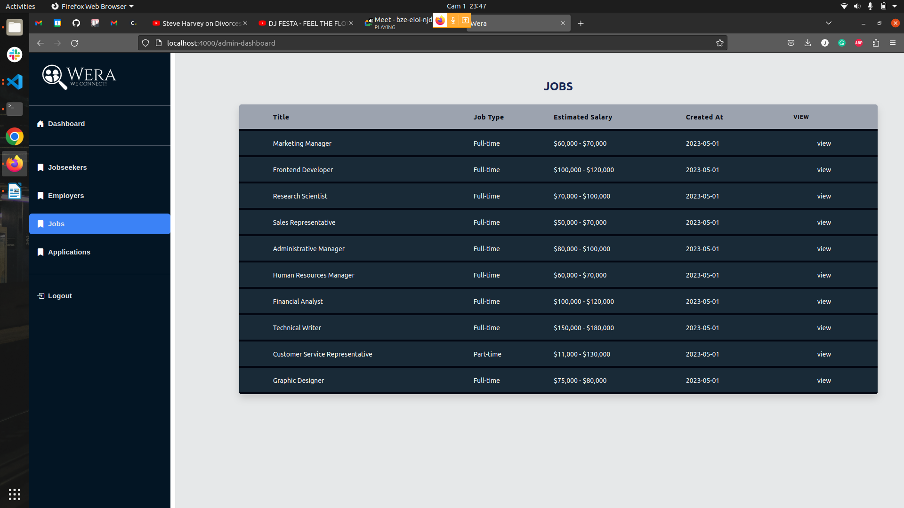
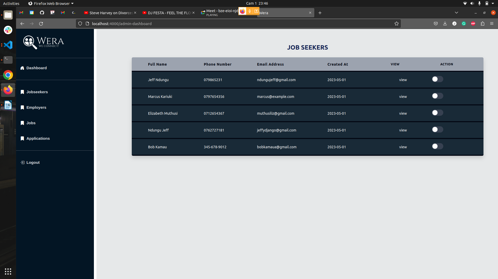
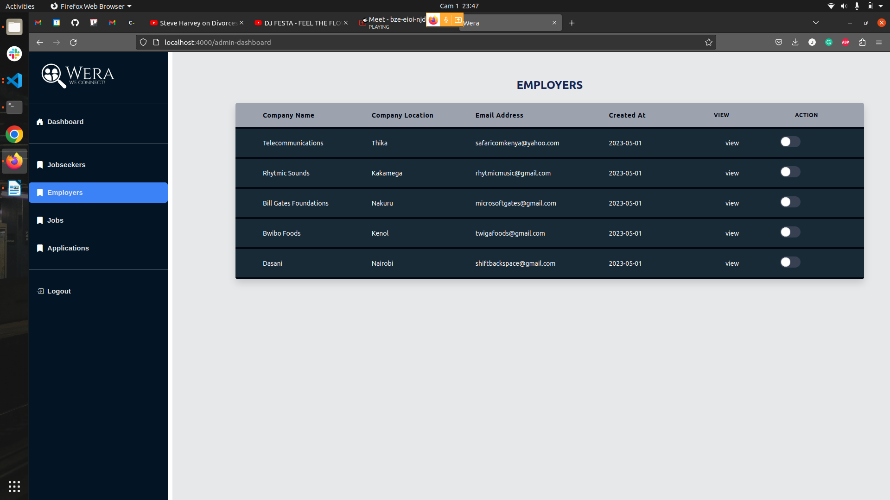

# Wera Frontend

## Description

This is the front end of the Wera job application site that utilises the React framework

## Contributors

- [alvinsleek](https://github.com/alvinsleek)
- [ndungu-jeff](https://github.com/ndungu-jeff)
- [marcus-kariuki](https://github.com/marcus-kariuki)
- [Elizabeth-M-M](https://github.com/Elizabeth-M-M)
- [Lik10280](https://github.com/Lik10280)
- [JMuhlanga](https://github.com/JMuhlanga)

## Technologies Used

1.  REACT
2.  HTML
3.  CSS
4.  Ruby on Rails
5.  Figma

## Screen Shots of the front-end

## Home Page

This is the first page that users encounter when they get to our site.

## Job Seeker Sign-up page

This page allows a job seeker to make an account to access this page.

## Job Seeker Log-in page

After registration is a success a job seeker would be required to log-in through this page.

## Employer Sign-up Page

This page allows employers to sign up to the platform.

## Employer Log-in Page

After a successful sign up the employer is able to log-in.

## Employer Landing Page without Jobs

After a successful log-in , the employer is led to their landing page which consists of some of the jobs that they may have.

## Employer Add Job

This page allows an employer to add a job listing from their organisation.

## Employer Landing Page With Job

After a Job is added, an employers landing page would be updated with their new entry.

## Admin Dashboard

This will be the admin dashboard landing page, they will be presented with basic stats at the center of the page

## Admin Applications Page

This page will display all the applications made onto the platform

## Admins Job Page

This page will be able to show the jobs posted on the page

## Admin Job Seekers page

This page will be able to reveal to the administrator the jobs seekers present in the page, the admin can block ones account incase of flagging by another member of the platform.

## Admin Employers Page

This page would allow the admin to see the employers within the platform , also incase of flagging their accounts can be blocked and the employer would need to talk to the admin to get unblocked.

